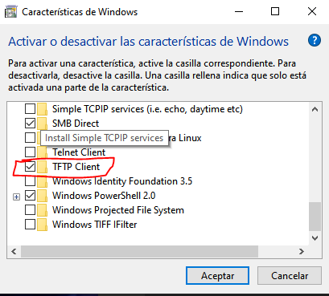
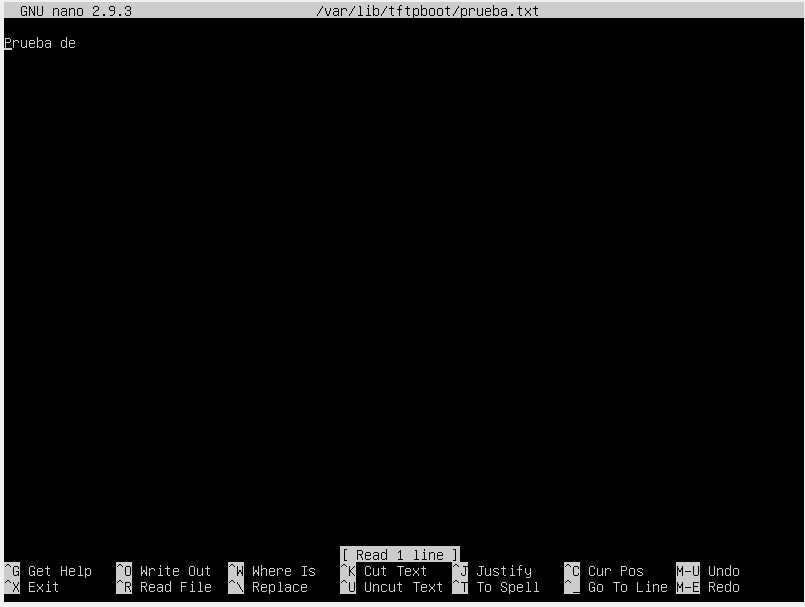
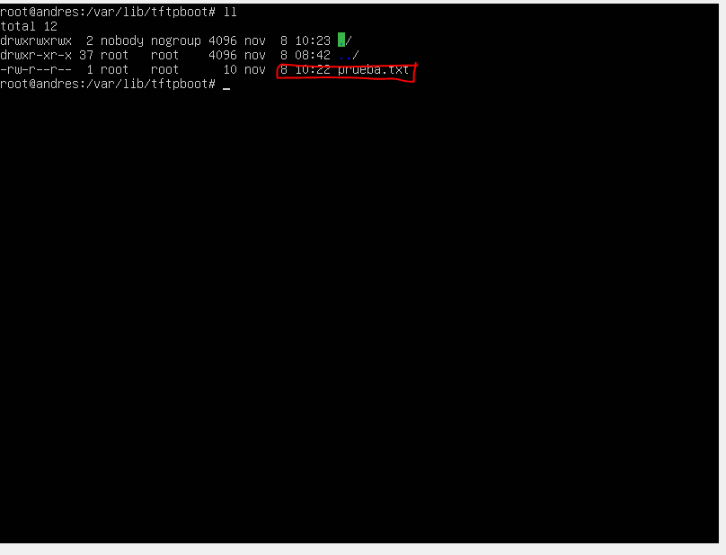
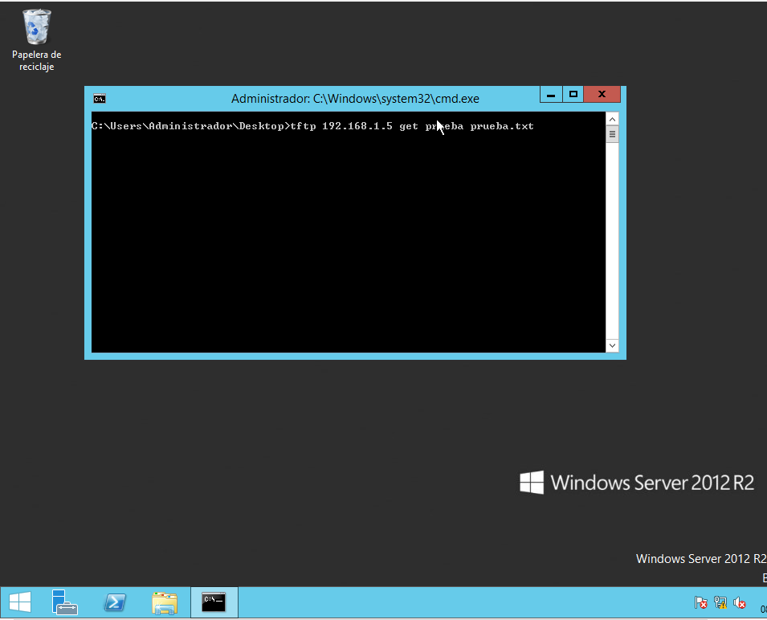
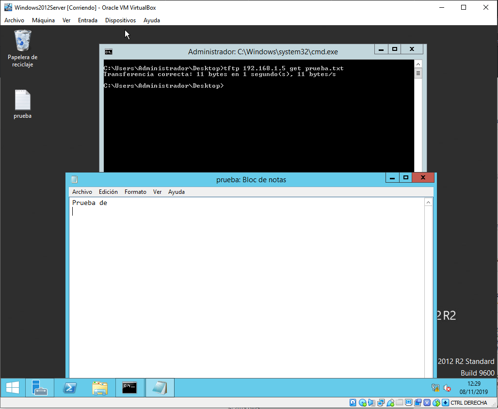
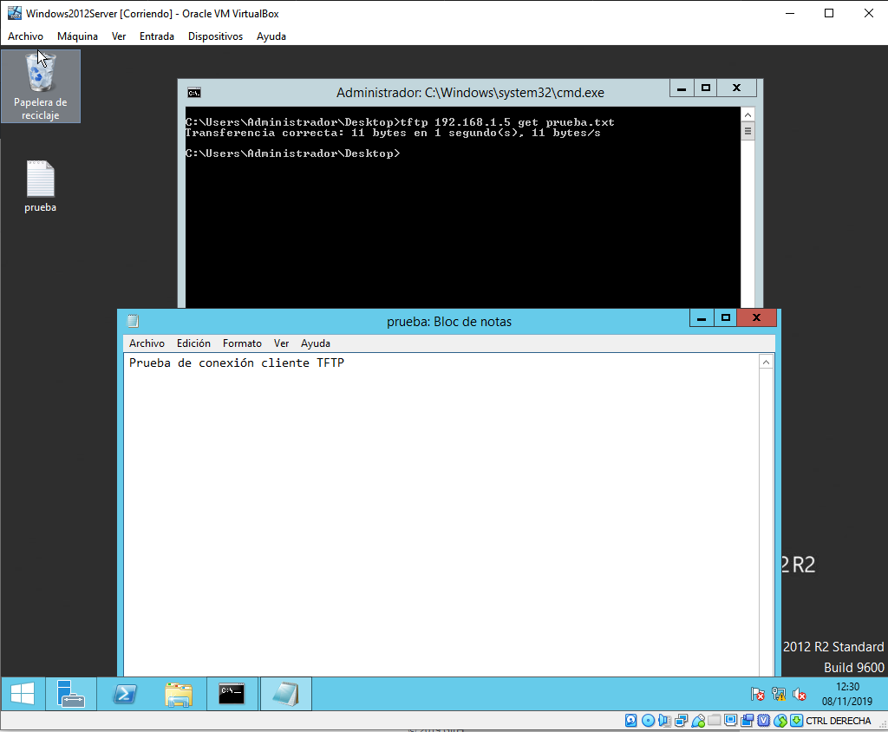
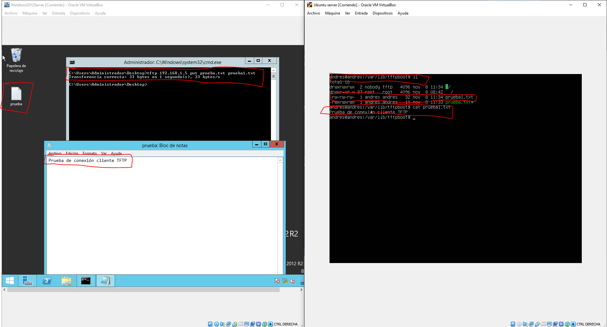

# TFTP-SERVER-CONFIG
Una guia para instalar el Servidor TFTP en ubuntu

## Indice
> Versión de ubuntu: 18.04

1. [Preparativos](#Preparativos).
2. [Instalación y configuración](#Instalación-y-configuración-del-servidor-TFTP).
3. [Comprobar que funciona](#Comprobar-que-funciona)

### Preparativos
> Antes de comenzar he de decir que yo estoy realizando las instalaciones en una maquina virtual con Virtual Box en un entorno encapsulado donde las tarjeta van a funcionar en red interna, y solo en NAT cuando necesito instalar paquetes el ubuntu.

Para comenzar la instalación antes de empezar a instalar y configurar el servidor TFTP en ubuntu, es aconsejable actualizar los repositorios del mismo, y se hace de la siguiente manera:

```bash
apt update && apt upgrade
```

### Instalación y configuración del servidor TFTP

Una vez tenemos actualizados los respositorios, instalamos el servidor TFTP con el siguiente comando:

```bash
apt install tftp-hpa
```

Cuando esté instalado para configurarlo nos vamos a su archivo de configuración se encuentra en la ruta **/etc/default/**, el nombre del archivo de configuración es **tftpd-hpa**, pero antes tocarlo le hacemos una copia de seguridad de la siguiente manera:

```bash
cp tftpd-hpa tftpa-hpa 
```
Hecha la copia de seguridad vamos a modificar el archivo con:

```bash
nano tftpd-hpa
```

Dentro del archivo saldrán varias opciones configuradas por defecto:
```
TFTP_USERNAME="tftp"
TFTP_DIRECTORY="/var/lib/tftpboot"
TFTP_ADDRESS=":69"
TFTP_OPTIONS="--secure"
```

Nosotros lo tenemos que dejar de la siguiente manera:

```
TFTP_USERNAME="nombreDeUsuario"
TFTP_DIRECTORY="/var/lib/laRutaQueQuerais"
TFTP_ADDRESS=":69"
TFTP_OPTIONS="-s -c -l"
```
Explicación del archivo:

- **TFTP_USERNAME:** como su nombre indica es para entrar al servidor con un usuario, ese usuario tiene que estar creado en el servidor, hay que usar por defecto el tftp.
- **TFTP_DIRECTORY:** aquí se especifica la ruta donde se subirán los archivos y de está ruta tambien será de donde se descargarán(se puede modificar a la que querais, siempre y cuando hagais esto).
- **TFTP_ADDRESS:** aquí se le puede especificar una dirección IP y un puerto en el que escuchar, por defecto viene con **:69** porque escucha en la dirección IP local y el puerto 69.

- **TFTP_OPTIONS:** estas son las opciones con las que se lanzará el servidor TFTP, las que hemos puesto hacen los siguiente:
    - **-s:** lo que entiendo en esta opción es que al estar activada tienes que asignar un directorio por defecto si o si, ya que si no está activa puede que el usuario se pueda mover libremente por los directorios.
    - **-c:** esta opción permite que los usuarios que se conecten al servidor puedan crear nuevos archivos, ya que por defecto TFTP solo permite la subida de archivos que ya existen, estos archivos se crean con los permisos por defecto lo que permite la lectura y escritura de los mismos.
    - **-l:** lanza el servidor de manera Standlone, es decir, que se lanza de manera solitaria sin pertenecer a ningun grupo como un servidor de dominio, hay ciertas opciones que se ignoran con esta opción.

[Aquí](https://linux.die.net/man/8/tftpd) podeis varias de las opciones del servidor TFTP.

Cuanto el archivo ya esté configurado guardamos con **CTRL+O** y salimos con **CTRL+X**.

Para continuar tenemos que **asignarle permisos y cambiar el propietario a la carpeta que le hemos asignado al servidor TFTP.**

Para asginar los maximo permisos a la carpeta lo hacemos con el siguiente comando:

```bash
chmod -R 777 /var/lib/tftpboot
```

Para cambiarle el propietario a la carpeta lo hacemos de la siguiente manera:
```bash
chown -R nobody /var/lib/tftpboot
```

#### ¿Pero para que le asignamose esos permisos y le ponemos ese propietario?

Sencillo, **si restringimos los permisos a esa carpeta** para empezar los usuarios no se van a poder conectar a la carpeta contenedora de los archivos.

Lo del **cambiarle el propietario a nobody**, es porque cuando tu te conectas al servidor TFTP sin inciar sesion, por defecto entras como el usuario **nobody**.

Ya solo faltaria levantar el servidor o reiniciarlo para ver si funciona:

```
service tftpd-hpa restart
```

### Comprobar que funciona

Antes de nada, tenemos que comprobar que las maquinas se hacen maquina mutuamente, porque claro si una no hace a la otra la transferencia de archivos no se va poder realizar.

Luego Para comprobar que funciona en windows es necesario activar una característica que se llama Cliente TFTP



Luego de instalar la característica en windows nos vamos a ir nuestro servidor **TFTP** y vamos a crear un txt, vamos a añadirle algo y luego lo vamos a modificar con el siguiente comando:

```bash
nano /var/lib/tftpboot/prueba.txt
```
Para que veais que lo he hecho:



Y para que veais que está en la carpeta:




Luego vamos a windows en el que tenemos el cliente TFTP instalado y nos movemos hacia el directorio donde queremos que se descargue el archivo, yo lo voy a ejecutar en el Escritorio, es decir **C:\Users\Administrador\Desktop** y ejecutamos el siguiente comando:

```bash
tftp 192.168.1.5 get prueba.txt
```

No hace falta decir que esa direccion ip y el nombre del archivo hay que sustituirlos por los vuestros

Imagen antes de ejecutar el comando: 



Despues de ejecutar el comando:



Ahora vamos a modificar el txt y lo vamos a subir con otro nombre:



Comando para subirlo:

```bash
tftp 192.168.1.5 put prueba.txt prueba1.txt
```



En la imagen se puede ver a la izquierda el windows cliente como tiene en el escritorio el archivo txt y está abierto para ver lo que contiene y como se ha ejecutado correctamente el comando.

En la derecha se muestra el servidor TFTP en ubuntu y se ve como en la direccion configurada se encuentra el archivo modificado y lo que contiene dentro.